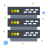

#  API MyContacts

#  Comandos do Docker

-   Baixar image do postgres do docker

```
sudo docker pull postgres
```

-   Listar image do docker

```
sudo docker image ls
```

-   Listar container do docker

```
sudo docker container ls
sudo docker ps
```

-   Listar todos os container do docker

```
sudo docker ps -a
sudo docker container ls
```

-   Inicializar um container do docker

```
sudo docker start pg
sudo docker (container Id)
```

-   Para um container no docker

```
sudo docker stop (nome do container)
sudo docker stop (container ID)
```

-   Remover um container no docker

```
sudo docker rmi (nome do repositori)
sudo docker stop (image ID)
```

-   Criando um container no docker

```
sudo docker run --name pg -e POSTGRES_USER=(nome do usuario) -e POSTGRES_PASSWORD=(senha) -p 5432:5432 -d postgres
```

-   Acessar container no docker

```
sudo docker exec -it pg bash
```

-   Logar no Postgres

```
psql -U (nome do usuario)
```

-   Lista as Base de Dados

```
\l
```

-   Conectando a uma Base de Dados

```
\c (nome da base de dados)
```

-   Listar todas as tabelas da Base de Dados

```
\dt
```

#  Criando banco de dados no Docker
